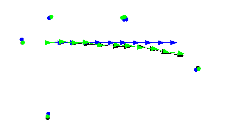

A planar navigation simulator (SLAM and A-Star search) with visualization.

There are two projects here:

First, a factor-graph based Simultaneous Localization and Mapping solver. This implementation does not address data association or loop closure issues. The optimizer is simply Newton's Method, and it uses dense Jacobians. At some point I may try to speed up the optimization by taking advantage of sparsity in the graph.

Second, a planning and control algorithm. The control is kinematic but has a _lot_ of noise. The goal location also has a lot of noise; we imagine it to be specified as GPS coordinates, and the robot has a bad magnetometer and GPS receiver. The planner is A-Star, with replanning at every timestep.

So far the SLAM solver is not used for state estimation in the planning algorithm, but it seems obvious that this should be done at some point.

## Dependencies

 * C++11
 * [Eigen](http://eigen.tuxfamily.org)
 * [SFML](https://www.sfml-dev.org/tutorials/2.5/)

On Ubuntu, you can install these via

```
sudo apt-get install libeigen3-dev
sudo apt-get install libsfml-dev
```

## Usage

To demo the planning and control algorithm:
```
make nav
./nav.out
```

To demo the SLAM solver:

```
make 2D
./2D.out
```



The ground truth trajectory is shown in black, odometry in blue, and the smoothed trajectory in green.

You can also do a simpler version, SLAM in only one dimension:

```
make 1D
./1D.out
```

To try an even simpler graph (not involving navigation simulation):

```
make graph
./graph.out
```
